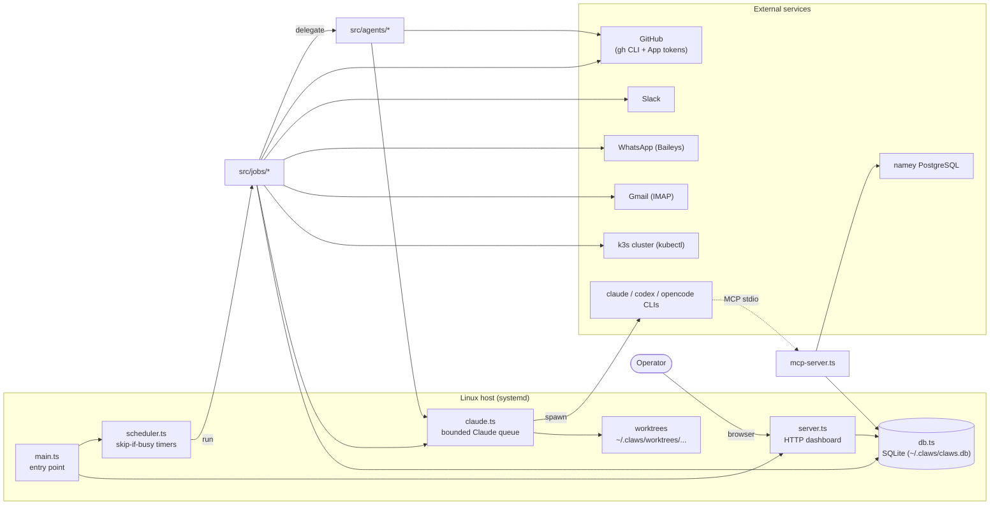
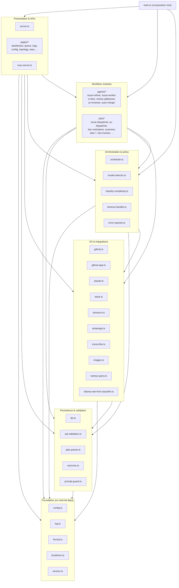
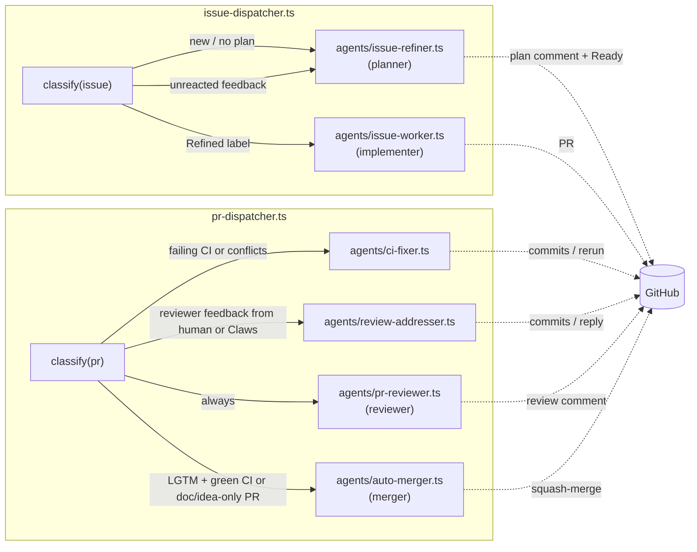
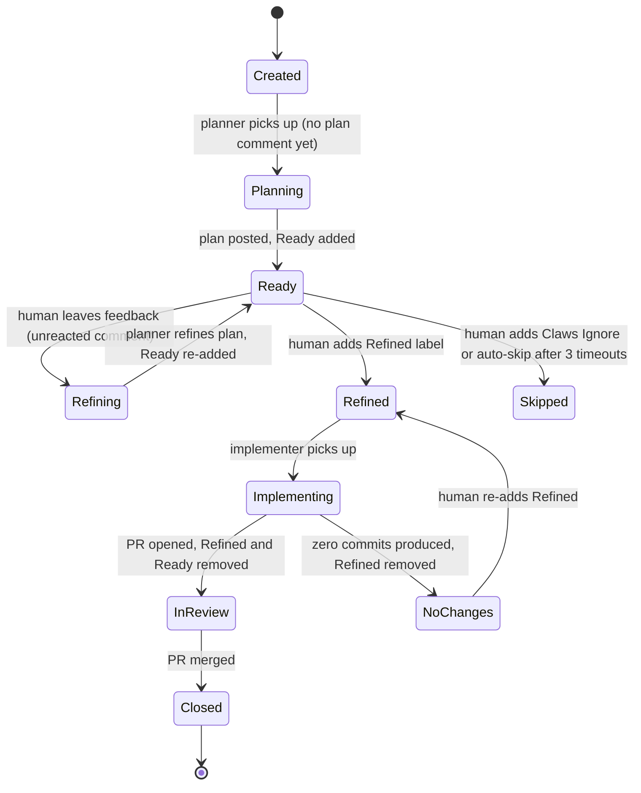
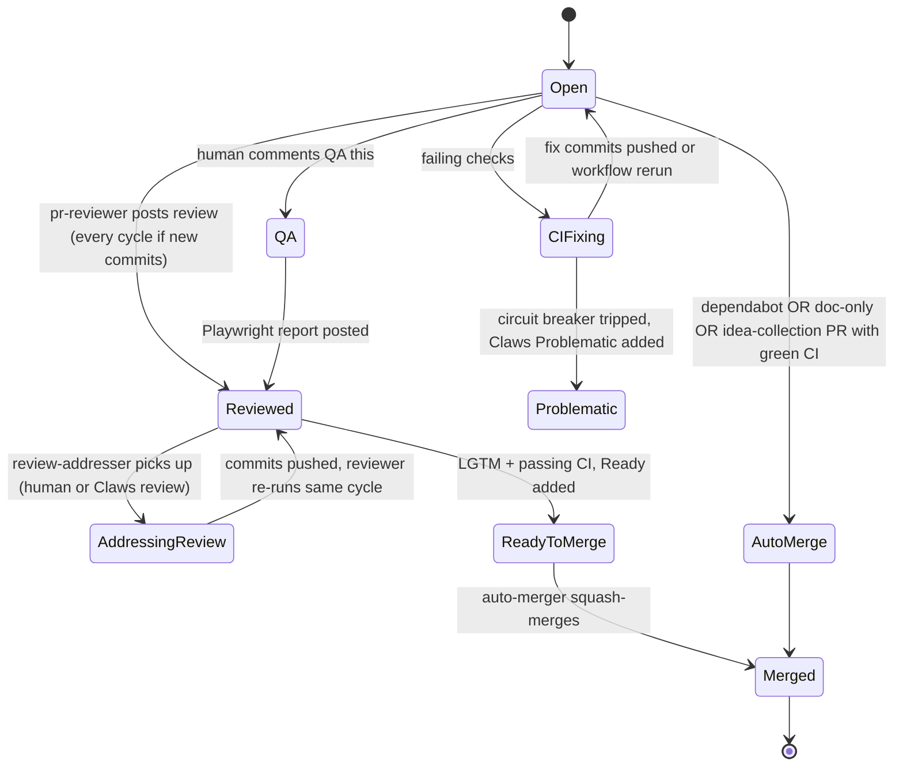
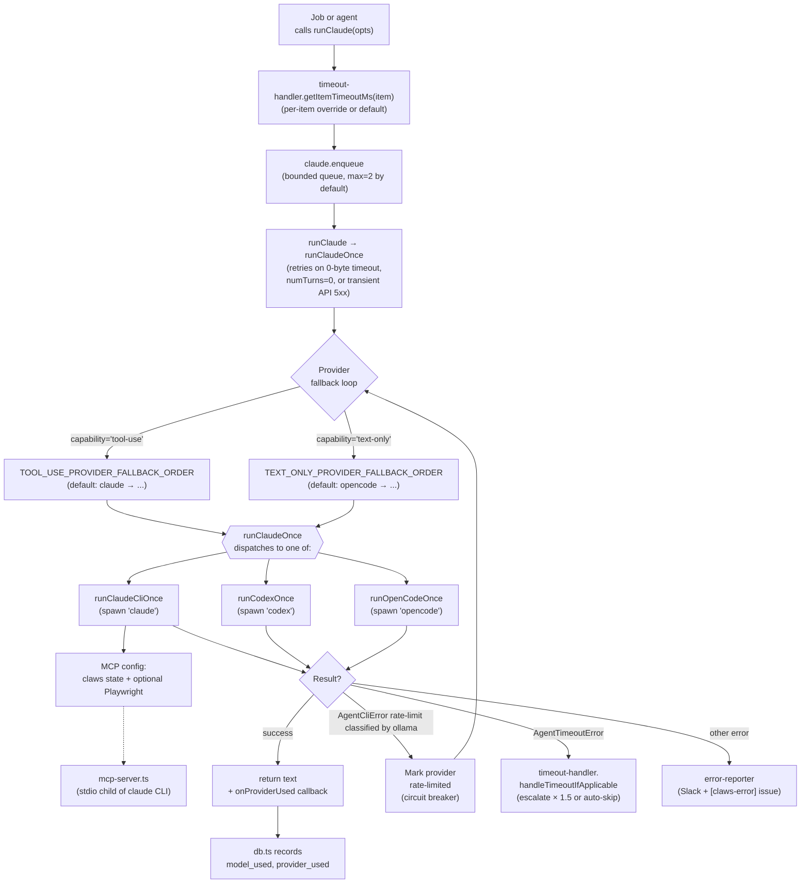
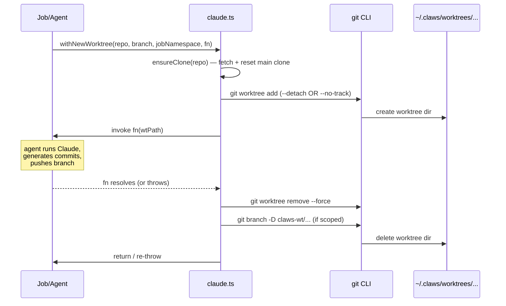
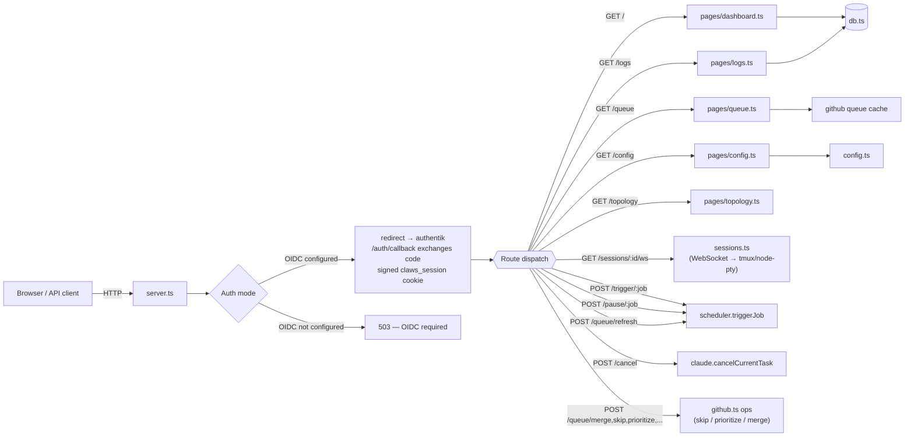

# Architecture Diagrams

A visual companion to [OVERVIEW.md](OVERVIEW.md). For prose descriptions of
each module, refer to OVERVIEW.md. This document focuses on **how the pieces
connect**.

All diagrams use [Mermaid](https://mermaid.js.org/), which GitHub renders
natively in markdown.

## Contents

- [System Overview](#system-overview)
- [Module Layering](#module-layering)
- [Dispatcher Fan-Out](#dispatcher-fan-out)
- [Issue Lifecycle](#issue-lifecycle)
- [PR Lifecycle](#pr-lifecycle)
- [Claude Invocation Path](#claude-invocation-path)
- [Worktree Lifecycle](#worktree-lifecycle)
- [HTTP / Dashboard Request Flow](#http--dashboard-request-flow)

---

## System Overview

The top-level shape: a single Node.js process registers ~21 scheduled jobs,
serves a dashboard, runs a bounded queue of `claude` CLI subprocesses in
isolated git worktrees, and persists everything to a local SQLite database.
External effects flow out via the `gh` CLI (GitHub) and Slack/WhatsApp/Email
gateways.

---

## Module Layering

Modules in `src/` form an informal layering. Lower layers know nothing about
higher ones; higher layers compose lower ones. This is a logical grouping, not
a directory structure.

> **Reading note:** `github-app.ts` produces installation tokens that
> `github.ts` and `claude.ts` consume via env-var injection — not via a direct
> function call. `agents/agent-context.ts` exports prompt-context strings
> shared across all agents.

---

## Dispatcher Fan-Out

Two dispatcher jobs (`issue-dispatcher`, `pr-dispatcher`) classify items once
per repo and fan out to per-concern agents. Agents are individually disablable
via `disabledAgents` in config.

> **Concurrency guard:** the pr-dispatcher skips review-addresser for PRs
> that already have ci-fixer work in the same cycle (and skips conflicting
> PRs entirely in the review-addresser phase) so that ci-fixer and
> review-addresser never push to the same branch concurrently.

---

## Issue Lifecycle

State transitions a typical issue moves through. Labels are shown in
**bold**. Most transitions are content-driven (comments, reactions, PR state)
rather than label-driven — `Refined` is the only label that itself triggers
work.

---

## PR Lifecycle

---

## Claude Invocation Path

Every agent and most jobs call `runClaude()` in `claude.ts`. This module owns
the bounded concurrent queue, multi-provider fallback, timeout handling, and
worktree integration.

---

## Worktree Lifecycle

Tasks operate in throwaway git worktrees so concurrent work on the same repo
cannot interfere. Always created and destroyed in pairs via the
`withNewWorktree` / `withExistingWorktree` helpers.

> **Crash recovery:** on startup, `main.ts` calls `db.findRunningTasks()`,
> reaps the dangling worktrees, and marks the tasks `failed`.

---

## HTTP / Dashboard Request Flow

The dashboard is built on the **Hono** framework (via `@hono/node-server`). All mutating
endpoints emit Slack notifications (gated by `notifyDashboardActions`).

---

## Where to go next

- For the prose description of each module's responsibilities, read
  [OVERVIEW.md](OVERVIEW.md).
- For database table definitions and indexes, read
  [database-schema.md](database-schema.md).
- For per-job behavior and failure modes, read [jobs/](jobs/README.md).
