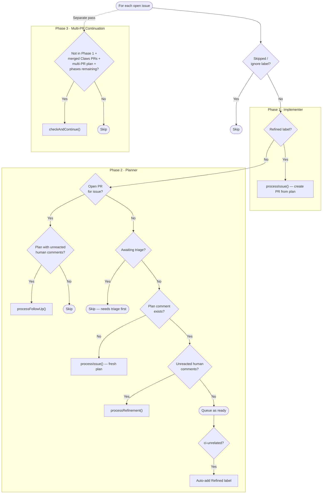

# issue-dispatcher

**Source**: `src/jobs/issue-dispatcher.ts`
**Interval**: 5 minutes (configurable via `intervals.issueDispatcherMs`)

Fetches all open issues once per repo, classifies each, and dispatches to agents in order:

1. **Implementer phase** — Issues with `Refined` label are passed to the implementer (issue-worker)
2. **Planner phase** — Remaining issues are classified and dispatched to the planner (issue-refiner): fresh plans, refinements, or follow-up responses
3. **Multi-PR continuation phase** — Issues with merged Claws PRs and remaining phases are passed to the implementer's `checkAndContinue()`

The `Ready` label is managed centrally: removed from issues entering work, ensured on idle issues with a plan.

Agent invocations are **fire-and-forget**: the dispatcher calls `worker.enqueue(...)`
to insert rows into the `work_queue` SQLite table and returns immediately, so the
scheduler run promise resolves promptly and subsequent ticks are not blocked. The
`work_queue` UNIQUE partial index on `(kind, repo, item_number) WHERE status IN
('queued', 'running')` prevents the same item from being dispatched concurrently
across overlapping cycles.

Phase 3 runs as a separate pass over all issues, checking for multi-PR plans
with remaining phases to continue. "Awaiting triage" means the issue is a
`[claws-error]` or kwyjibo game-ID issue that hasn't received an investigation
report yet.

## Planner (issue-refiner)

**Source**: `src/agents/issue-refiner.ts`
**Agent name**: `Planner`

Issues without a body are still processed — the prompt uses "(No description
provided)" as a fallback, allowing Claude to plan from the title alone.

Three modes:

### Fresh planning (no plan comment exists)

- Creates a worktree on branch `claws/plan-<N>-<hex4>`
- Asks Claude for a fresh implementation plan
- Posts the plan as a comment prefixed with `## Implementation Plan`
- Adds the `Ready` label (signals "Claws is done, your turn")
- Before planning, fetches other open issues in the repo with lower numbers than
  the current one and includes them in the prompt as duplicate candidates. If
  Claude identifies the current issue as sharing a root cause with an existing
  one, the planner posts a minimal "See #N" plan on the duplicate (keeping it
  open) and a back-reference comment on the canonical. The lowest-numbered
  issue wins canonical status — this deterministically resolves races when
  co-created alerts (e.g. k3s pod/namespace alerts) are planned in parallel.

### Refinement (unreacted human comments after plan)

- Finds human comments posted after the latest plan comment
- Checks each comment for a 👍 reaction from Claws (tracked items)
- If unreacted comments exist, creates a worktree on branch `claws/plan-<N>-<hex4>`
- Asks Claude to produce an updated plan addressing the feedback, plus a
  `### Response` section directly answering any questions or acknowledging
  concerns
- **Edits the original plan comment in-place** (rather than posting a new one),
  keeping context concise as plans are refined iteratively
- If a `### Response` section is present in Claude's output, posts it as a
  **separate follow-up comment** so the user receives a direct answer to
  their questions (the response is stripped from the plan before editing)
- Reacts 👍 to each addressed comment
- Re-adds the `Ready` label
- If no plan comment is found (e.g. it was deleted), falls back to posting a
  fresh plan comment

### Follow-up response (issue has an open PR)

When an issue has an open PR (implementation in progress), the planner checks
for unreacted human comments posted after the plan. If found:

- Creates a worktree so Claude can read the repo for context
- Asks Claude to respond to the follow-up questions (not produce a new plan)
- Posts Claude's response as a **new comment** (does not edit the plan)
- Reacts 👍 to each addressed comment
- Does **not** change labels (the issue is already in implementation)

The `findUnreactedHumanComments()` helper (shared with the refinement flow)
filters out Claws-authored comments (via marker), bot comments, and comments
from non-allowed actors (via `isAllowedActor()`), then checks each for a 👍
reaction from Claws. This prevents infinite response loops since Claws's own
responses are filtered out on the next pass, and ensures only trusted users
can trigger refinement or follow-up responses.

To iterate on a plan: post feedback comments on the issue. The planner will
detect unreacted comments and update its plan. Repeat until satisfied, then add
`Refined` to trigger implementation.

All prompts instruct Claude to read `docs/OVERVIEW.md` first if it exists.
Images embedded in issue bodies are downloaded and provided to Claude for
visual context.

## Implementer (issue-worker)

**Source**: `src/agents/issue-worker.ts`
**Agent name**: `Implementer`

- Removes the `Ready` label (work starting)
- Creates a worktree on branch `claws/issue-<N>-<hex4>`
- Provides the issue title, body, and all comments as context
- Instructs Claude to read `docs/OVERVIEW.md` for codebase context
- The prompt explicitly instructs Claude **not** to create a pull request or
  push the branch — these steps are handled by Claws after Claude finishes
- Claude implements the changes and makes commits
- If commits were produced: pushes the branch, generates a PR description
  (via a second Claude call with the diff, falling back to a diffstat if that
  fails), creates a PR titled `fix: resolve #N — <title>` that closes
  the issue
- Any GitHub closing keywords (`Closes #N`, `Fixes #N`, etc.) that Claude
  includes in the generated description are stripped before building the PR
  body, preventing premature issue closure on intermediate multi-PR phases
- Adds the `In Review` label to the issue (signals a PR is open for review)
- Removes the `Refined` label

### Multi-PR issues

If the implementation plan contains multiple `### PR N:` phases, the worker
creates one PR per phase:

- Each intermediate PR references `Part of #N` (not `Closes`), keeping the
  issue open
- The final PR uses `Closes #N` to auto-close the issue on merge
- PR titles include `(N/total)` suffixes

Before implementing each subsequent phase, the worker updates the plan comment
to reflect completed work: completed phases get `[COMPLETED]` prepended to
their titles, and remaining phases are revised to account for what has already
been merged. A `<!-- plan-updated-after-phase:N -->` marker prevents redundant
updates.

Between phases, the worker scans open issues for ones with merged `claws/`
PRs but more phases remaining. When a PR has been merged and more phases
remain, it re-adds the `Refined` label, which triggers the next phase on the
next run. The current phase is determined by counting merged PRs with branch
prefixes matching the issue.
