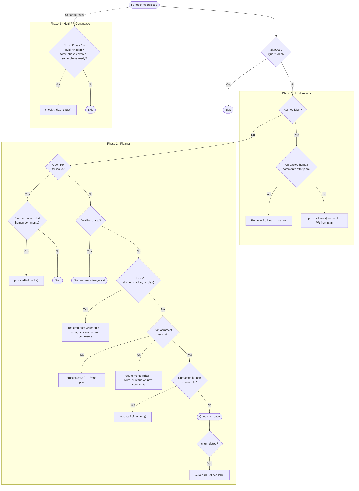

# issue-dispatcher

**Deep dive.** Read this when you're changing issue planning, refinement,
duplicate handling, or implementation dispatch. For PR-side automation, read
pr-dispatcher.md instead.

Product requirements: [product/automation-lifecycle.md](../product/automation-lifecycle.md)

**Source**: `src/jobs/issue-dispatcher.ts`
**Interval**: 5 minutes (configurable via `intervals.issueDispatcherMs`)

Each repo's cycle opens with the **dependency sweep** (`issue-links.ts`'s `releaseDependencyParkedIssues`): every Blocked native issue whose primary repo this is, and whose unreleased "depends on" links all point at closed issues, is moved out of Blocked with a comment naming the dependencies that cleared — to Awaiting plan review when it has a real plan, to Planning with an `issue-refiner:replan` enqueued when its last plan is the planner's blocked verdict, and, when it has none, to Planning for the next cycle to plan if its requirements were approved and to Ideas otherwise. The links are then stamped released, so a human who re-parks the issue later is not undone. A sweep failure is reported and never costs the repo its cycle; released issues are skipped by Phases 2 and 3 this tick. See [issue-tracker.md#links](../issue-tracker.md#links).

Then it fetches all open issues once per repo, classifies each, and dispatches to agents in order:

1. **Implementer phase** — Issues with `Refined` are passed to the implementer — unless there is unaddressed human feedback after the plan, in which case `Refined` is removed and the issue is routed to the planner instead (#2772)
2. **Planner phase** — Remaining issues are classified and dispatched to the planner (issue-refiner): fresh plans, refinements, or follow-up responses. An issue with no plan comment also gets the [requirements writer](#requirements-writer), and an issue still in **Ideas** gets *only* the writer — the [promotion gate](#promotion-gate) holds the planner until its requirements are promoted
3. **Multi-PR continuation phase** — Issues with a multi-PR plan, at least one covered phase, and remaining phases are passed to the implementer's `checkAndContinue()`. The phase count comes from the issue's stored PR list (`claws_issue_prs`, via `planned-prs.ts`) when one exists, and from the plan's `### PR N:` headers otherwise. Coverage comes from the stored entries' linked PRs, falling back to `phase-coverage.ts` for unlinked entries and for issues with no stored list, so a phase shipped by a human or by an interactive session that explicitly stepped in counts — the gate is *not* Claws' own merged-PR count. A phase is continued once it is *ready* — uncovered, with every phase it depends on (transitively) merged or claimed — so a plan that declares a step `(parallel)` or `(after PR 1)` gets that step's PR while sibling PRs are still open; with no declared dependencies each step waits for the previous one to merge, as before. When nothing is ready the dispatcher logs the open and blocked phases and moves on. Phases 1 and 2 decide between a follow-up and a re-plan by asking `listOpenPhasePRs` (`planned-prs.ts`) for every open step PR — the issue repo's `claws/issue-<ref>-` branches plus the stored list's linked PRs open in their own repos — so feedback on a multi-repo or parallel plan is answered as a follow-up that names the PR it applies to.

Phases 1 and 3 share the **dependency gate**: an issue — native, or a forge issue through its shadow — with a "depends on" link to a still-open issue is never handed to the implementer, and the skip is logged with the open dependencies. Planning is not gated.

The `Ready` label is managed centrally: removed from issues entering work, ensured on idle issues with a plan.

Agent invocations are **fire-and-forget**: the dispatcher calls `worker.enqueue(...)`
to insert rows into the `work_queue` SQLite table and returns immediately, so the
scheduler run promise resolves promptly and subsequent ticks are not blocked. The
`work_queue` UNIQUE partial index on `(kind, repo, item_number) WHERE status IN
('queued', 'running')` prevents the same item from being dispatched concurrently
across overlapping cycles. A row is a candidate, not a decision: workers claim by
Priority (which incident labels such as `grafana-alert` also set), then stage rank (merge-nearest first), then age, and re-validate the item
before spawning; re-enqueueing a queued item refreshes its Priority flag (see
[SQLite-Backed Work Queue](../patterns.md#sqlite-backed-work-queue)).

```mermaid
flowchart TD
    Fetch(["For each open issue"]) --> Skip{"Skipped /<br/>ignore label?"}
    Skip -->|Yes| End1(["Skip"])
    Skip -->|No| P1Q

    subgraph P1 ["Phase 1 · Implementer"]
        P1Q{"Refined label?"}
        P1Q -->|Yes| P1F{"Unreacted human<br/>comments after plan?"}
        P1F -->|Yes| P1R["Remove Refined → planner"]
        P1F -->|No| P1A["processIssue() — create PR from plan"]
    end
    P1Q -->|No| P2PR

    subgraph P2 ["Phase 2 · Planner"]
        P2PR{"Open PR<br/>for issue?"}
        P2PR -->|Yes| P2FU{"Plan with unreacted<br/>human comments?"}
        P2FU -->|Yes| P2FUA["processFollowUp()"]
        P2FU -->|No| P2S1(["Skip"])

        P2PR -->|No| P2T{"Awaiting triage?"}
        P2T -->|Yes| P2S2(["Skip — needs triage first"])
        P2T -->|No| P2ID{"In Ideas?<br/>(forge: shadow, no plan)"}
        P2ID -->|Yes| P2RWI["requirements writer only —<br/>write, or refine on new comments"]
        P2ID -->|No| P2PL{"Plan comment<br/>exists?"}
        P2PL -->|No| P2NP["processIssue() — fresh plan"]
        P2PL -->|No| P2RW["requirements writer —<br/>write, or refine on new comments"]
        P2PL -->|Yes| P2HC{"Unreacted human<br/>comments?"}
        P2HC -->|Yes| P2RF["processRefinement()"]
        P2HC -->|No| P2RD(["Queue as ready"])
        P2RD --> P2CI{"ci-unrelated?"}
        P2CI -->|Yes| P2AR["Auto-add Refined label"]
    end

    Fetch -.->|"Separate pass"| P3Q

    subgraph P3 ["Phase 3 · Multi-PR Continuation"]
        P3Q{"Not in Phase 1 +<br/>multi-PR plan +<br/>some phase covered +<br/>some phase ready?"}
        P3Q -->|Yes| P3A["checkAndContinue()"]
        P3Q -->|No| P3S(["Skip"])
    end
```

Phase 3 runs as a separate pass over all issues, checking for multi-PR plans
with remaining phases to continue. "Awaiting triage" means the issue is a
`[claws-error]` issue that hasn't received an investigation report yet.

## Owner requirements

- **A "nothing to do" outcome must be filtered out *before* an issue is created in
  the target repo** — a refined-as-no-action plan, or a Dependabot alert with no
  action available, should never reach a human as an open issue (#1747, #1757,
  #1769/#1775). #1775 put the broader question directly: "is alert monitoring
  actually giving us anything except noise?" — a monitor that files issues nobody
  can act on is the failure mode to design against.
- **A repo's own labels are its own.** A managed repo can add labels Claws doesn't
  know about (e.g. bonkus's `needs-ios-build`) and Claws must not strip them
  (#1807). The cross-repo label-colour-consistency machinery that came with that
  request was later found to be genuinely dead — nothing consumed the labels
  anywhere — and was removed (#1928); that *supersedes* #1807's premise that the
  machinery was needed long-term, but not the underlying "don't strip a repo's own
  labels" rule.
- **Bonkus's separate triage bot ("kwyjibo") is retired** (#1612): the Claws
  lifecycle covers what it did, so triage behaviour belongs in this pipeline rather
  than in a per-repo bot.

## Requirements writer

**Source**: `src/agents/requirements-writer.ts`
**Agent name**: `Requirements writer`
**Task job name**: `requirements-writer`

Phase 3 of the [issue flow](../refinements/issue-flow.md). In the planner
phase, before the fresh-plan enqueue, every issue with no plan comment — and
every issue in Ideas — is checked against its latest requirements version — one batched read per tick
(`listLatestClawsIssueRequirementsForOpenIssues`), keyed by tracker id, so a
forge issue is looked up through its shadow:

- **No version** → enqueue `requirements-writer:write`. For an issue past
  Ideas (promoted by hand before a record existed) the planner is enqueued
  alongside and plans from the issue body.
- **A version, and unreacted human comments after the `## Requirements`
  comment** → enqueue `requirements-writer:refine`.

Both kinds are issue-scoped with stage rank 8, below `issue-refiner:plan`.
`[claws-error]` issues awaiting triage are skipped as for the planner, and
`disabledAgents: ["requirements-writer"]` turns the writer off (the planner
phase itself is still gated on `planner`).

A run creates a worktree on `claws/req-<N>-<hex4>` and resolves the
`requirements` model-plan phase (default claude/`sonnet`; `Plan: Deep` asks
for `fable` on a write run, and a refine run falls back to `sonnet`). The
prompt carries the title, body, comments, attachment names and the repo-docs
context, and asks for the record only — no decisions, implementation or plan.
The agent saves the record with `claws_save_requirements`
(`src/requirements-tools.ts`), which writes validated JSON to a file beside
the run's MCP config; the writer reads it after the CLI exits, so the path is
the same in an agent pod. No file, or an invalid one, fails the task and posts
nothing.

- **Write** — posts the record as a `## Requirements` Claws comment (native or
  forge), re-lists the comments to find its id, and stores version 1 (minting
  a forge issue's shadow if it has none).
- **Refine** — edits that comment in place, stores the next version with the
  same comment id, and 👍s each addressed comment.

Versions are shown on the native issue page's Requirements block; see
[issue-tracker.md#requirements](../issue-tracker.md#requirements).

### Promotion gate

The dispatcher never enqueues the planner for an issue in **Ideas**: it gets
the writer paths above (write with no version, refine on new comments) and
nothing else, until a human promotes it or its first version auto-promotes it
([issue-tracker.md#requirements](../issue-tracker.md#requirements)). A native
issue's stage comes with the listing (`Issue.lifecycle`). A forge issue's lives
on its shadow — `resolveTrackerId` with create, so a new forge issue starts in
Ideas like a native one — and is read only when the issue has no plan comment:
a forge issue that already has a plan is past Ideas whatever its shadow says,
since shadows predate the stage and the boot migration could not see forge
plan comments. A failed stage read is logged and treated as "not in Ideas", so
the planner runs as it always did rather than stalling. Everywhere past Ideas
the planner phase is unchanged. Demoting an issue back to Ideas skips its
queued `issue-refiner:*` rows; a running one finishes.

Every tick, an issue the gate holds in Ideas also gets a **level-triggered**
auto-promotion check (`clawsIssues.autoPromoteIfDue`), not just the
version-write listener [issue-tracker.md#requirements](../issue-tracker.md#requirements)
describes. The listener only fires at the moment a version lands, so an issue
that reached Ideas with one already on record — written before the listener
existed, or by a writer run that predates a deploy — would otherwise sit there
until a human noticed. The tick check promotes it instead, the same way the
listener would have. With `requirements-writer` disabled outright no version
will ever land, so the tick check treats that as "ready" too and promotes
straight from the body (Promotion decision 10) rather than leaving every new
issue stuck in Ideas for as long as the writer stays off.

## Planner (issue-refiner)

**Source**: `src/agents/issue-refiner.ts`
**Agent name**: `Planner`

Issues without a body are still processed — the prompt uses "(No description
provided)" as a fallback, allowing Claude to plan from the title alone.

Three modes:

### Fresh planning (no plan comment exists)

- Creates a worktree on branch `claws/plan-<N>-<hex4>`
- Asks Claude for a fresh implementation plan
- Posts the plan as a comment prefixed with `## Implementation Plan`
- Plans now start by restating the user's requirement in unambiguous language,
  then surface decisions or assumptions that may need correction, then provide
  concise implementation guidance. They should still name important files,
  modules, facts, and verification steps, but should not default to exhaustive
  line-number instructions a capable implementer can infer from the code.
- Adds the `Ready` label (signals "Claws is done, your turn")
- Before planning, fetches other open issues in the repo with lower numbers than
  the current one and includes them in the prompt as duplicate candidates. If
  Claude identifies the current issue as sharing a root cause with an existing
  one, the planner posts a minimal "See #N" plan on the duplicate (keeping it
  open) and a back-reference comment on the canonical. The lowest-numbered
  issue wins canonical status — this deterministically resolves races when
  co-created alerts (e.g. k3s pod/namespace alerts) are planned in parallel.
  Each candidate's body is `guardContent()`-scanned against its **own** issue
  number, not the issue being refined (#2526) — `buildDuplicateCandidatesSection()`
  previously reused one guard context bound to the issue being refined for
  every candidate, so an injection-like phrase in an old candidate's body
  posted a false-positive alert comment on the wrong issue and re-fired on
  every future refine in the repo (the dedup key was the current issue, which
  never changed). Candidate bodies are also truncated to
  `DUPLICATE_CANDIDATE_BODY_LIMIT` **before** guarding, not after, so a match
  beyond the truncation point — text the model never sees — can't trigger an
  alert at all.
- Includes the issue's comments in the prompt alongside the body — for a
  `[claws-error]` issue this is how the `triage-claws-errors` investigation
  report reaches the planner; before this, applying `Needs Refinement` after
  an investigation produced a plan based only on the raw stack trace, ignoring
  the root-cause analysis already posted (#149)
- Also before planning, if the issue looks obviously mis-filed the planner can
  instead transfer it to another repo under the same GitHub owner (#2216):
  it posts a `## Repository Transfer` comment naming the destination and
  rationale, then calls `gh issue transfer`. This is capped at one hop and
  disabled via `CLAWS_PLANNER_TRANSFER=false`. See [Cross-repo issue
  transfer](../patterns.md#content-based-state-machine) in patterns.md for
  the full design, including why the routing comment must never carry the
  `## Implementation Plan` header.

### Refinement (unreacted human comments after plan)

- Finds human comments posted after the latest plan comment
- Checks each comment for a 👍 reaction from Claws (tracked items)
- If unreacted comments exist, creates a worktree on branch `claws/plan-<N>-<hex4>`
- Asks Claude to produce an updated plan addressing the feedback, plus — only
  when there is human feedback to respond to — a `### Response` section
  directly answering any questions or acknowledging concerns
- **Edits the original plan comment in-place** (rather than posting a new one),
  keeping context concise as plans are refined iteratively
- If a `### Response` section is present **and the run was triggered by human
  feedback**, posts it as a separate follow-up comment (the section is always
  stripped from the plan before editing). Occurrence-triggered re-plans
  (`ISSUE_REFINER_REPLAN`, empty feedback list) never post one — before #2558
  they posted a "no feedback was left, so I re-verified…" comment on every
  occurrence-doubling pass, six Claws comments in nine hours on
  `fleet-infra#878`. A re-plan's only visible effect is the in-place edit of
  the plan comment.
- Reacts 👍 to each addressed comment
- Re-adds the `Ready` label
- If no plan comment is found (e.g. it was deleted), falls back to posting a
  fresh plan comment

### Issue previews

When the issue has an open preview PR on a `claws/preview-issue-<id>` branch in any
of its repositories, fresh-plan and refinement prompts (not follow-ups) carry an
`## Issue preview` section naming the PR, branch and head, and the rule to re-run
the repository's preview step only when the revised plan changes what the preview
shows — never for a prose-only change. Right after posting or editing a plan the
planner syncs the issue's `## Preview` comment; retirement on `Refined` or close
is [issue-preview-sync](issue-preview-sync.md)'s job.

### Stale-plan guards

A plan is written against a snapshot of the issue, and the planner run takes
minutes. Without a guard, an issue edited during or after that run keeps a plan
that contradicts it, and nothing in the pipeline ever notices — body edits are
invisible to the refinement path, which only looks at comments *after* the plan
comment (#2524).

Every posted or edited plan comment therefore carries two trailing markers:

- `CLAWS_PLAN_BODY_HASH: <sha256>` — a hash of the issue title+body the plan was
  actually written against, plus the content of the issue's approved
  requirements version when it has one (`src/approved-requirements.ts`), so
  re-approving an edited requirements record re-plans the same way a body edit
  does. With no approved record the hash is title+body only, as before. The planner re-reads the issue **uncached**
  (`gh.getIssueTitleBody`) at run start, because the dispatcher's issue list is
  60 s cached; stamping the cached copy would leave the hash permanently lagging
  and re-plan on every tick. Trailing whitespace, CRLF and surrounding blank
  lines are normalised out, so cosmetic edits do not trigger a re-plan.

  Consolidated alert-bridge bodies — identified structurally by the
  `## Currently firing` and `## Alerts` headings, as emitted by fleet-infra's
  and production-infra's alert bridges — have their volatile parts stripped
  before hashing too: the Currently firing list; the Status, Last occurrence,
  Occurrences and Resolved table rows; the Summary and Description lines; the
  carried-over-count line; and the trailing occurrence block. Unlike other
  occurrence-tracked issues (see "Claws-maintained alert issues are exempt"
  below), a bridge body is **not** exempt from the hash check, so a new or
  removed alert section, or a human edit, still re-plans — a routine firing or
  resolve does not.

  A plan that predates the issue's approved requirements record (an old-shape
  plan with its own `### Requirement` section, or one refined against a record
  that has since been re-approved) is expected to drop that section and cite
  the record's version on its next refinement. When a refinement instead keeps
  the section — or comes back empty/degenerate while the record is newer than
  the plan's stamp — `trackRequirementsUpgradeStall()` (`src/agents/issue-refiner.ts`)
  posts (and, on later stalls, edits in place) a single notice comment carrying
  `CLAWS_REQUIREMENTS_UPGRADE_STALLED: v<version> attempts=<n>`, keyed to the
  record version so a newly re-approved record starts the count over. The plan
  itself is stamped body-only while the count is below
  `MAX_REQUIREMENTS_UPGRADE_ATTEMPTS` (3), so the dispatcher's hash check above
  keeps retrying the upgrade on every tick. Once the cap is hit, Claws gives up:
  the plan is stamped against the record anyway (even though its text was never
  actually rewritten) so it stops being re-queued forever, and the notice says
  so. A stall that reaches the cap and then stalls again restarts the count at
  1 rather than continuing past the cap. A successful upgrade resets a prior
  notice to `attempts=0`.
- `CLAWS_PLAN_LAST_COMMENT: <id>` — the highest comment id the run had seen.
  A comment posted mid-run lands *before* the plan comment in thread order and
  would otherwise never be treated as feedback; `selectFeedbackCandidates()`
  unions "after the plan comment" with "id greater than this fence". A fence of
  `0` is stamped when the run's snapshot held no comments at all (a brand-new
  issue), which makes every comment on the issue count as feedback; the marker
  being **absent** instead means a legacy plan predating the marker, and only
  then does the after-the-plan-only fallback apply. Stamping `0` rather than
  omitting the marker is what fixes the freshly-filed-issue case (#2623), where
  a comment posted between issue creation and the plan landing was otherwise
  ignored forever.

The hash is checked in three places:

- **Dispatcher, steady state** — an issue with a plan, no outstanding feedback
  and a mismatching hash has `Ready` stripped and an `ISSUE_REFINER_REPLAN`
  enqueued. The mismatch is re-confirmed uncached first, so a stale cache entry
  never costs a planner run. Multi-PR continuations are exempt here too (see
  below): between "phase N merged" and Phase 3 re-applying `Refined`, the issue
  has neither an open PR nor `Refined`, so it passes through this branch — and
  re-planning would discard the plan Phase 3 is implementing against.
- **Implementer** (`issue-worker.processIssue`) — a mismatch removes `Refined`,
  posts a notice comment (marked `CLAWS_STALE_PLAN_NOTICE: <plan hash>`) and
  returns without implementing, leaving the dispatcher to re-plan on the next
  tick. The notice is keyed to the stamped hash rather than to "any notice after
  the plan": a re-plan edits the plan comment in place, so a positional check
  would let the first event's notice silently suppress every later one.
  This is what catches a human applying `Refined` to an already-stale plan.
  Multi-PR continuations are deliberately **not** gated: `checkAndContinue` just
  re-applies `Refined` and re-enters `processIssue`, so the guard skips itself
  whenever the issue already has merged Claws PRs — phase 2+ follows a plan that
  was already agreed and partly shipped, and re-planning mid-way would strand the
  merged phases.
- Legacy plans carry no hash marker and are always treated as fresh, so nothing
  re-plans on rollout.

**Known gap: no file-tree drift detection (#1343).** The hash only covers the
issue title+body; it says nothing about `main`'s file tree changing between plan
generation and refinement (files a plan names getting renamed, moved, or
restructured). The owner's stated requirement is that a structural change like
that should make the planner re-cut a **fresh full plan**, not patch around
stale paths, and mark the superseded plan as such. This is not implemented —
there is no comparison of the plan's referenced paths against `main`'s current
tree anywhere in the refine/implement path — so a plan can still go stale this
way with no guard catching it.

**Claws-maintained alert issues are exempt.** Any issue carrying an
occurrence-tracking block (`**Occurrences:** N`) has its body rewritten by
`ensureAlertIssue` on every monitor tick — `refreshBody: true` callers such as
`host-disk-monitor` embeds live `df` output, so the prose
genuinely changes tick to tick. Hash staleness never fires for those issues; the
`REPLAN_OCCURRENCE_FACTOR` occurrence-doubling rule below governs their re-planning
cadence instead. Without this exemption every monitor issue would re-plan on every
dispatcher tick and become permanently un-implementable. These occurrence-triggered
re-plans are silent by design — they edit the plan comment in place and post nothing
else (see #2558 above). The exemption runs before the hash compare, so a re-approved
requirements record on such an issue does not re-plan it either until the occurrence
rule fires.

### Follow-up response (issue has an open PR)

When an issue has an open PR (implementation in progress), the planner checks
for unreacted human comments posted after the plan. If found:

- Creates a worktree so Claude can read the repo for context
- Asks Claude to respond to the follow-up questions (not produce a new plan)
- Posts Claude's response as a **new comment** (does not edit the plan)
- Reacts 👍 to each addressed comment
- Does **not** change labels (the issue is already in implementation)

The `findUnreactedHumanComments()` helper (shared with the refinement flow)
filters out Claws-authored comments (via marker), bot comments, and comments
from non-allowed actors (via `isAllowedActor()`), then checks each for a 👍
reaction from Claws. This prevents infinite response loops since Claws's own
responses are filtered out on the next pass, and ensures only trusted users
can trigger refinement or follow-up responses.

To iterate on a plan: post feedback comments on the issue. The planner will
detect unreacted comments and update its plan. Repeat until satisfied, then add
`Refined` to trigger implementation. For a native issue, a comment posted
through the dashboard's comment form re-queues the planner immediately, in the
same request; a comment left on the forge itself waits for the next
issue-dispatcher tick. Attaching a file from a native issue's Attachments
section counts the same way: the upload route posts an "Attached …" comment on
the uploader's behalf, so it re-plans like any other feedback (with or without
JS, immediately if the plan is Awaiting review) — see
[issue-tracker.md](../issue-tracker.md#attachments).

All prompts instruct Claude to read `docs/OVERVIEW.md` first if it exists.
Images embedded in issue bodies are downloaded and provided to Claude for
visual context.

## Implementer (issue-worker)

**Source**: `src/agents/issue-worker.ts`
**Agent name**: `Implementer`

- Removes the `Ready` label (work starting)
- Creates a worktree on branch `claws/issue-<N>-<hex4>`
- Provides the issue title, body, and all comments as context
- Instructs Claude to read `docs/OVERVIEW.md` for codebase context
- The prompt explicitly instructs Claude **not** to create a pull request or
  push the branch — these steps are handled by Claws after Claude finishes
- Claude implements the changes and makes commits
- If commits were produced: pushes the branch, generates a PR description
  (via a second Claude call with the diff, falling back to a diffstat if that
  fails), creates a PR titled `fix: <title>` whose body's `Closes #N`
  line closes the issue
- Any GitHub closing keywords (`Closes #N`, `Fixes #N`, etc.) that Claude
  includes in the generated description are stripped before building the PR
  body, preventing premature issue closure on intermediate multi-PR phases
- Links the PR's `claws_prs` row to the issue — the board's PR open and
  Awaiting merge columns read that row; no label marks an open PR
- Removes the `Refined` label

### Multi-PR issues

If the implementation plan needs several PRs, the worker creates one PR per
phase. The planner saves the PR list through `claws_save_plan`, and the
refiner stores it on the issue's tracker record (`claws_issue_prs`); that list
is the source of truth for the PR count and each PR's title, and each PR the
worker opens (or pushes onto via `CLAWS_TARGET_PR`) is linked to its entry, so
a linked entry is covered by its PR's state — merged is done, open is pending,
closed-unmerged unlinks it. An issue with no stored list (planned before the
list existed, or by a provider that never called the tool) falls back to
counting `### PR N:` headers and matching `(N/M)` markers, unchanged:

- Each intermediate PR references `Part of #N` (not `Closes`), keeping the
  issue open
- A PR opened when every other phase has already merged or been claimed uses
  `Closes #N` to auto-close the issue on merge. Steps of a parallel plan can
  merge in any order, so the PR that completes the plan may carry only
  `Part of`; the auto-merger's post-merge hook then posts one Implementer
  comment and closes the issue once every step has merged or been claimed
- PR titles include `(N/total)` suffixes

Before implementing each subsequent phase, the worker posts a separate
**"Phase Progress"** comment (not an edit to the plan) summarizing completed
PRs and the next phase — the original plan is deliberately left untouched
here (#273: an earlier design that rewrote the plan comment on every phase
was found to destroy a well-refined plan, superseding #262's simpler "leave a
marker in the plan" framing). Separately, after a phase's PR merges,
`checkAndContinue()` runs an LLM check (`validateAndUpdatePlan()`) comparing
the merged diff against that phase's plan text; only if the implementation
deviated significantly does it rewrite the plan comment (adjusting the
completed phase's description and downstream phases to match reality) —
otherwise it just stamps a plain-text `plan-updated-after-phase:N` marker and
leaves the plan as-is (the parser also still accepts a legacy
`<!-- ... -->`-wrapped form for backward compatibility with older comments).

Between phases, the worker scans open issues for ones with merged `claws/`
PRs but more phases remaining. When a PR has been merged and more phases
remain, it re-adds the `Refined` label, which triggers the next phase on the
next run.

The next phase is the lowest *ready* phase: not in the issue's
**covered-phase set** (`src/phase-coverage.ts`), and with every phase it
depends on done. Each phase depends on the previous one unless the stored
list's `depends_on` or the plan header's `(after PR N)` / `(parallel)`
suffix says otherwise, so an independent step can start while a sibling's PR
is still open. The worker opens one phase PR per run, so a plan's independent
steps each get their PR one dispatcher tick apart. The covered-phase set
unions three sources:

- **Cross-referencing PRs.** Every PR that references the issue — any author,
  any branch, open or merged — matched to a phase by its `(N/M)` title suffix
  or its `## PR N of M` body header. Closed-unmerged PRs are excluded, so
  closing a bad duplicate reopens its phase, and a marker whose denominator no
  longer matches the plan's phase count (a re-plan) is ignored.
- **`claws-phase-done: <numbers>` claim comments** (a comma list or hyphen
  range) from allowed actors, for steps that produce no PR at all — a manual
  apply, a workflow dispatch, work already covered elsewhere. The claim must be
  the first text on its own line and must not be inside a code fence or a
  blockquote, and a comment carrying the "Automated by Claws" footer never
  counts — Claws posts the claim *instructions*, and matching them let the
  planner claim the very step it was describing (#3154).
- **Merged PRs on `claws/issue-<N>-` branches**, the pre-existing positional
  accounting, which is what the coverage set degrades to if the timeline
  lookup fails.

When every phase is covered, the dispatcher stops continuing the issue and
`checkAndContinue()` stops re-adding `Refined`. This exists because phase
accounting keyed purely on Claws' own branch prefix could not see work done
out-of-band: in production-infra#1313 an interactive session hand-rolled and
merged steps 2–4 while the pipeline, blind to them, opened two duplicate PRs
(#2594). Sessions can query the covered-phase set through the
`claws_issue_phases` MCP tool before taking a step themselves.
