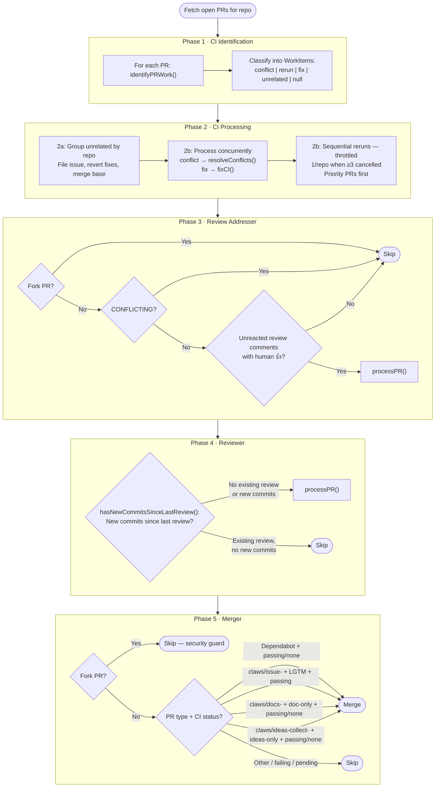
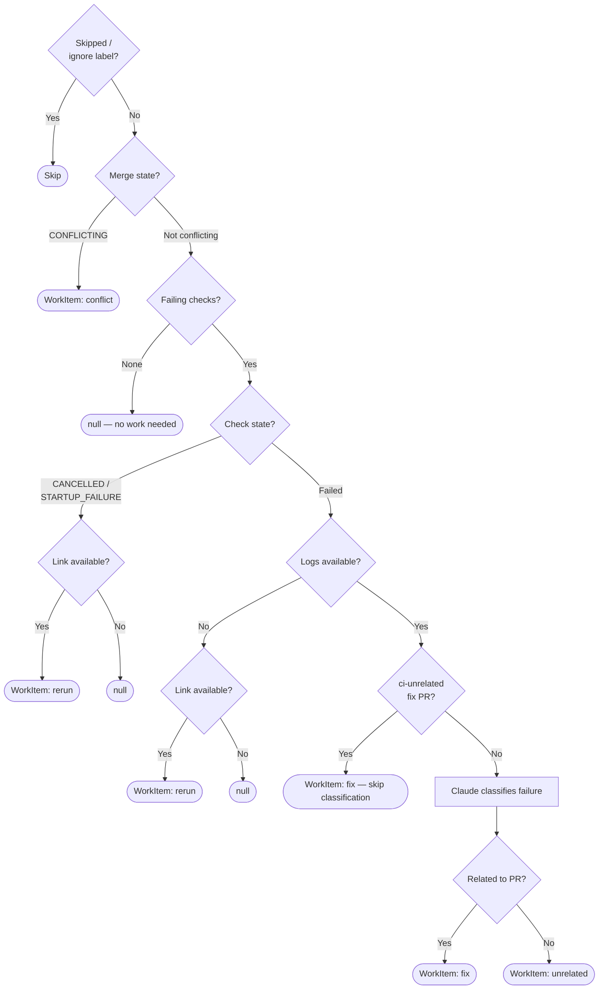

# pr-dispatcher

**Source**: `src/jobs/pr-dispatcher.ts`
**Interval**: 5 minutes (configurable via `intervals.prDispatcherMs`)

Fetches all open PRs once per repo, classifies each, and dispatches to agents in phases.
Fork PRs (`isCrossRepository`) are skipped across all phases as a security
guard — since Claude runs with `--dangerously-skip-permissions`, untrusted
PR content must not be processed.

Agent invocations are **fire-and-forget**: dispatchers call `worker.enqueue(...)`
to insert rows into the `work_queue` SQLite table and return immediately. This keeps
the dispatcher's run promise short-lived so the scheduler's `runningFlags` guard is
released promptly, preventing subsequent ticks from being blocked while long-running
agent tasks complete. The `work_queue` UNIQUE partial index on
`(kind, repo, item_number) WHERE status IN ('queued', 'running')` is the idempotency
mechanism — a second `enqueue()` for the same in-flight item no-ops silently.

1. **CI identification phase** — For each PR, `identifyPRWork()` classifies failures into typed `WorkItem` entries (discriminated union: `conflict`, `rerun`, `unrelated`, `fix`)
2. **Unrelated failure grouping** — Groups unrelated failures by repo (structural dedup), files consolidated `[ci-unrelated]` issues, reverts previous unrelated fixes, merges base if behind
3. **CI processing phase** — Processes conflicts and fixes concurrently (fire-and-forget via `worker.enqueue`); throttles reruns to 1 per repo per cycle (priority-labeled PRs first)
4. **Review addresser phase** — Same-repo PRs with unaddressed review comments (fork PRs excluded, CONFLICTING PRs skipped)
5. **Reviewer phase** — PRs needing review (no existing review or new commits since)
6. **Merger phase** — Eligible PRs (Dependabot, LGTM'd Claws, doc, idea-collection)

### CI identification detail

The `identifyPRWork()` classification logic for Phase 1:

## CI Fixer

**Source**: `src/agents/ci-fixer.ts`
**Agent name**: `CI Fixer`

Two responsibilities, checked in order for each PR:

### 1. Resolve merge conflicts

Checks `getPRMergeableState()`. If `CONFLICTING`:

- Creates a worktree from the PR branch
- Attempts `git merge origin/<base>` — if clean, pushes directly
- If conflicts exist, passes the conflict file list to Claude with
  instructions to resolve markers and complete the merge
- On failure, aborts the merge

If conflicts were resolved, the CI fix step is skipped (the fresh merge
commit will trigger a new CI run).

### 2. Fix CI failures

If checks are in a cancelled/startup-failure state, re-runs the workflow
instead of trying to fix code. When 3+ PRs in the same repo have cancelled
checks (concurrency bottleneck), reruns are throttled to 1 per repo per cycle
— priority-labeled PRs are rerun first. Benign "already running" errors
(where the workflow restarted between detection and rerun) are caught and
logged at info level rather than reported as errors.

If Claude classifies the failure as unrelated to the PR (flakey tests, runner
issues, pre-existing failures), the failure is filed on a consolidated
per-repo `[ci-unrelated]` issue rather than attempting a code fix. Unrelated
failures are grouped by repo during the identify phase (structural dedup),
so concurrent PRs with unrelated failures in the same repo produce a single
issue rather than duplicates. All unrelated failures for a repo are tracked
in a single issue (titled `[ci-unrelated] CI failures unrelated to PR
changes`), with each occurrence logged as a comment containing the
fingerprint, PR reference, reason, a link to the failing GitHub Actions run,
and abbreviated log.

**Exception — `[ci-unrelated]` fix PRs**: When the PR being processed is
itself a fix for a `[ci-unrelated]` issue (detected by `[ci-unrelated]` in
the PR title), classification is skipped entirely and failures are always
treated as related. Without this guard, the classifier would see pre-existing
failures, classify them as "unrelated", and the PR would stall indefinitely
in a loop of filing redundant issues and reverting fix attempts. Errors on
these PRs are posted as comments directly on the PR (using an in-place
edit pattern to avoid spam) rather than creating `[claws-error]` issues.

Otherwise:
- Fetches the failed run log via `getFailedRunLog()` (truncated to 20KB).
  The log fetch has a two-tier fallback: the primary `gh run view --log-failed`
  CLI command is tried first; if it returns empty (e.g. runner cancellations
  produce no structured failure output) or throws, the REST API endpoint
  (`/actions/jobs/{jobId}/logs`) is tried as a fallback. If both return empty,
  the workflow is re-run instead of being silently skipped.
- Creates a worktree from the PR branch
- Passes the failure log to Claude to analyze and fix
- Pushes fix commits

## Review Addresser

**Source**: `src/agents/review-addresser.ts`
**Agent name**: `Review Addresser`

For each same-repo PR (fork PRs are excluded) with unreacted review comments:

- Fetches all review feedback: review bodies (with state), inline code
  comments (with diff hunks), and general PR comments
- Returns `PRReviewData` with formatted text plus separate `commentIds` and
  `reviewCommentIds` arrays for reaction tracking
- Filters out comments belonging to **resolved** review threads (uses GraphQL
  API to check thread resolution status, since REST doesn't expose this)
- Filters out bare "LGTM" issue-tab comments (approval signals for
  auto-merger, not review feedback)
- Filters out comments that already have a 🚀 reaction from Claws (addressed)
- Human comments (inline and issue-tab) are processed automatically — no 👍 needed
- Claws-authored suggestions require a 👍 from a human before implementation
- Skips PRs where all comments have been addressed (no actionable comments)
- Downloads images embedded in review comments for visual context
- Removes the `Ready` label (work starting)
- Creates a worktree from the PR branch
- Passes all unresolved feedback to Claude
- Pushes fix commits
- For Claws PRs (`claws/` branch prefix): regenerates and updates the PR description
- For non-Claws PRs: preserves the human-authored PR description
- Posts Claude's response summarizing actions taken as a **single** comment
  per PR, edited in place each round (`postOrEditAddresserComment()`, marked
  with a hidden `review-addresser-summary` marker) rather than a fresh
  comment every round — avoids per-round comment spam on long review loops
  (#1927, post-mortem of bonkus#1513)
- Reacts 🚀 to each addressed comment (both issue comments and review comments)
- Adds the `Ready` label (signals "Claws is done, your turn")

## Reviewer (pr-reviewer)

**Source**: `src/agents/pr-reviewer.ts`
**Agent name**: `Reviewer`

Reviews all open PRs (including Claws's own PRs) and posts advisory feedback
comments highlighting potential issues.

For each open PR:

- Skips PRs in the `skippedItems` config list or with the `Claws Ignore` label
- Skips PRs that already have a Claws `## PR Review` comment with no new
  commits since, via `hasNewCommitsSinceLastReview()`. This internally finds
  the latest review comment and compares its embedded `<!-- reviewed-commit: <sha> -->`
  marker against the PR's current HEAD via `getPRHeadSHA()`. Legacy comments
  without a marker are always re-reviewed.
- Re-reviews when new commits have been pushed after the last review
- All PRs are reviewed using `getModel()` (defaults to opus).
- Creates a worktree from the PR branch for full codebase context
- Gets the three-dot diff (`origin/<base>...HEAD`) and sends it to Claude
  with instructions to identify bugs, security issues, performance problems,
  missing error handling, style inconsistencies, and test coverage gaps
- Posts (or edits) a **single** review comment per PR with a `## PR Review`
  header — `postOrEditReview()` edits the existing Claws review comment in
  place each round instead of posting a fresh one, so discussion threads stay
  attached to one comment. Each prior round's visible content is preserved in
  a collapsed `

Previous review iterations …
`
  audit log (capped at 6 entries / 2500 chars each) appended to the comment,
  so `getReviewHistory()` can recover full multi-round context for the
  "step back and reassess recurring themes" prompt rather than only the
  latest round (#1927, post-mortem of bonkus#1513)
- If no issues found (`NO_ISSUES_FOUND` response or empty output): the
  comment body becomes "Reviewed — no issues found" with a
  `review-result: clean` marker (ensures the PR is not re-reviewed every
  cycle)
- If the PR has an empty diff (all commits cancel out): the comment body
  becomes a "no net changes" note advising closure, without invoking Claude
- If Claude's findings are **advisory-only** (non-blocking): the comment gets
  a `review-result: advisory` marker — recorded for the audit trail but does
  **not** trigger another review-addresser round, and the PR remains
  Ready-eligible (CI passing + no merge conflicts)
- Otherwise the review is **blocking** (default): withholds the `Ready` label
  and the review-addresser will act on it next cycle
- After `MAX_REVIEW_ITERATIONS` (8) rounds without converging (and the round
  is not advisory-only), the reviewer stops re-litigating and **escalates to
  a human**: posts a `review-result: escalated` marker plus a banner and adds
  the `Manual Action` label. Escalated reviews are never Ready-eligible
  (unlike advisory)
- Errors are caught per-PR and reported without blocking other PRs

**Interaction with review-addresser**: independent of the `clean`/`advisory`/
`escalated`/blocking classification above (which governs whether the reviewer
re-fires itself and whether Ready is withheld), Claws-authored suggestions
always require a human 👍 before the review-addresser will implement them —
human comments on PRs, by contrast, are processed automatically with no 👍
needed. The review-addresser marks addressed comments with 🚀 to prevent
reprocessing.

## Merger (auto-merger)

**Source**: `src/agents/auto-merger.ts`
**Agent name**: `Merger`

Before merging any PR, checks `getPRMergeableState()` — if `CONFLICTING`,
skips the PR (ci-fixer is responsible for resolving conflicts). Transient
`UNKNOWN` states are not blocked — if truly conflicting, the merge will fail
naturally. For each PR:

- **Dependabot PRs** (`dependabot[bot]` or `app/dependabot` author): merges if all CI checks pass or no checks exist
- **Claws PRs** (`claws/issue-` branch prefix): merges if the PR has a valid
  LGTM comment AND all CI checks pass. LGTM validation uses
  `isClawsComment()` (marker-based) rather than self-login to identify
  Claws-authored comments, so LGTM from a shared GitHub account is accepted.
  Merge-from-base commits (e.g. from ci-fixer resolving conflicts) do not
  invalidate an existing LGTM. Other substantive commits pushed after the
  LGTM invalidate it and another LGTM is required.
- **Doc PRs** (`claws/docs-` branch prefix): merges without requiring LGTM.
  Safety guards: verifies all changed files are doc-only (`docs/**` or
  `*.md`) — if any non-doc files are present, the PR is skipped with a
  warning. Since doc-only PRs skip CI (via `paths-ignore` in workflows),
  accepts both "passing" checks and "no checks" (CI never ran). Rejects
  failing or in-progress checks.
- **Idea-collection PRs** (`claws/ideas-collect-` branch prefix): merges without
  requiring LGTM. Safety guard: verifies all changed files are under `ideas/`.
  Accepts both "passing" checks and "no checks" (CI may not trigger for
  ideas-only changes). Rejects failing or in-progress checks.
- On merge of a Claws PR, removes the `In Review` label from the linked issue
- Other PRs are ignored
- If checks are failing: logs a warning and skips
- If checks are pending: skips silently
- Does not create worktrees or invoke Claude — purely a merge gate
