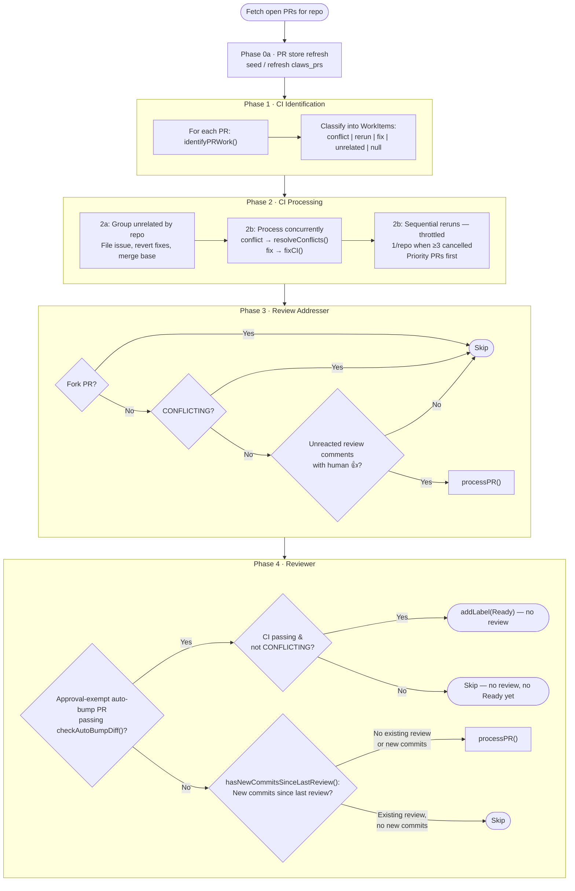
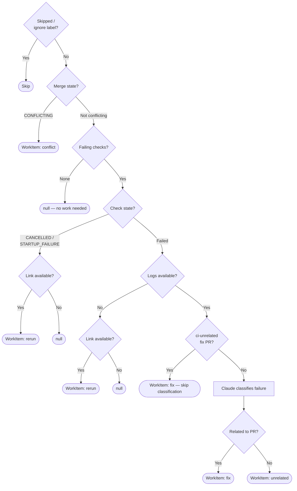

# pr-dispatcher

**Deep dive.** Read this when you're changing PR review, CI fixing, conflict
handling, or automerge dispatch. For issue-side automation, read
issue-dispatcher.md instead.

Product requirements: [product/automation-lifecycle.md](../product/automation-lifecycle.md)

**Source**: `src/jobs/pr-dispatcher.ts`
**Interval**: 5 minutes (configurable via `intervals.prDispatcherMs`)

Fetches all open PRs once per repo, classifies each, and dispatches to agents in phases.
Fork PRs (`isCrossRepository`) are skipped across all phases as a security
guard — since Claude runs with `--dangerously-skip-permissions`, untrusted
PR content must not be processed.

Agent invocations are **fire-and-forget**: dispatchers call `worker.enqueue(...)`
to insert rows into the `work_queue` SQLite table and return immediately. This keeps
the dispatcher's run promise short-lived so the scheduler's `runningFlags` guard is
released promptly, preventing subsequent ticks from being blocked while long-running
agent tasks complete. The `work_queue` UNIQUE partial index on
`(kind, repo, item_number) WHERE status IN ('queued', 'running')` is the idempotency
mechanism — a second `enqueue()` for the same in-flight item no-ops silently
(apart from refreshing a still-queued row's Priority flag). A row is a candidate, not
a decision: workers claim by Priority, then stage rank (merge-nearest first), then
age, and re-validate the PR before spawning (see
[SQLite-Backed Work Queue](../patterns.md#sqlite-backed-work-queue)).

1. **CI identification phase** — For each PR, `identifyPRWork()` classifies failures into typed `WorkItem` entries (discriminated union: `conflict`, `rerun`, `unrelated`, `fix`)
2. **Unrelated failure grouping** — Groups unrelated failures by repo (structural dedup), files consolidated `[ci-unrelated]` issues, reverts previous unrelated fixes, merges base if behind
3. **CI processing phase** — Processes conflicts and fixes concurrently (fire-and-forget via `worker.enqueue`); throttles reruns to 1 per repo per cycle (priority-labeled PRs first)
4. **Review addresser phase** — Same-repo PRs with unaddressed review comments (fork PRs excluded, CONFLICTING PRs skipped)
5. **Reviewer phase** — PRs needing review (no existing review or new commits since); skips the model
   review entirely for a PR the auto-merger's auto-bump gate would already accept without a human
   approval — `auto-bump` label, approval-exempt, and `checkAutoBumpDiff()` (shared with the
   [Merger](#merger-auto-merger)) says the diff is nothing but an own-image pin re-pin. Instead, once
   `getPRCheckStatus()` is passing and `getPRMergeableState()` is not `CONFLICTING`, it applies `Ready`
   itself, so the auto-merger merges the PR exactly as today — CI and that structural gate are the only
   checks it ever got (clw_01M3A3Q2250GM0NRAW0J86YX3T)

pr-dispatcher does not run the merger. The [`auto-merger`](auto-merger.md) scheduler
job evaluates every open PR for merge every three minutes (#2971); the Merger
section below documents the gates it applies.

```mermaid
flowchart TD
    Fetch(["Fetch open PRs for repo"]) --> P0A["Phase 0a · PR store refresh<br/>seed / refresh claws_prs"] --> P1

    subgraph P1 ["Phase 1 · CI Identification"]
        P1A["For each PR: identifyPRWork()"] --> P1B["Classify into WorkItems:<br/>conflict | rerun | fix | unrelated | null"]
    end

    P1 --> P2

    subgraph P2 ["Phase 2 · CI Processing"]
        P2A["2a: Group unrelated by repo<br/>File issue, revert fixes, merge base"]
        P2B["2b: Process concurrently<br/>conflict → resolveConflicts()<br/>fix → fixCI()"]
        P2C["2b: Sequential reruns — throttled<br/>1/repo when ≥3 cancelled<br/>Priority PRs first"]
        P2A --> P2B --> P2C
    end

    P2 --> P3

    subgraph P3 ["Phase 3 · Review Addresser"]
        P3F{"Fork PR?"} -->|Yes| P3S(["Skip"])
        P3F -->|No| P3M{"CONFLICTING?"}
        P3M -->|Yes| P3S
        P3M -->|No| P3B{"Unreacted review comments<br/>with human 👍?"}
        P3B -->|No| P3S
        P3B -->|Yes| P3C["processPR()"]
    end

    P3 --> P4

    subgraph P4 ["Phase 4 · Reviewer"]
        P4G{"Approval-exempt auto-bump PR<br/>passing checkAutoBumpDiff()?"}
        P4G -->|Yes| P4R{"CI passing &<br/>not CONFLICTING?"}
        P4R -->|Yes| P4L(["addLabel(Ready) — no review"])
        P4R -->|No| P4S2(["Skip — no review, no Ready yet"])
        P4G -->|No| P4A{"hasNewCommitsSinceLastReview():<br/>New commits since last review?"}
        P4A -->|No existing review<br/>or new commits| P4C["processPR()"]
        P4A -->|Existing review,<br/>no new commits| P4S(["Skip"])
    end

```

### CI identification detail

The `identifyPRWork()` classification logic for Phase 1:

```mermaid
flowchart TD
    A{"Skipped /<br/>ignore label?"} -->|Yes| Skip(["Skip"])
    A -->|No| B{"Merge state?"}
    B -->|CONFLICTING| C(["WorkItem: conflict"])
    B -->|Not conflicting| D{"Failing checks?"}
    D -->|None| E(["null — no work needed"])
    D -->|Yes| F{"Check state?"}
    F -->|"CANCELLED /<br/>STARTUP_FAILURE"| F2{"Link available?"}
    F2 -->|Yes| G(["WorkItem: rerun"])
    F2 -->|No| G2(["null"])
    F -->|Failed| H{"Logs available?"}
    H -->|No| H2{"Link available?"}
    H2 -->|Yes| I(["WorkItem: rerun"])
    H2 -->|No| I2(["null"])
    H -->|Yes| J{"ci-unrelated<br/>fix PR?"}
    J -->|Yes| K(["WorkItem: fix — skip classification"])
    J -->|No| L["Claude classifies failure"]
    L --> M{"Related to PR?"}
    M -->|Yes| N(["WorkItem: fix"])
    M -->|No| O(["WorkItem: unrelated"])
```

### Phase 0a: PR store refresh

Right after the open-PR list is fetched — raw, with `listPRs(repo, { raw: true })`,
so the refresh never reads the façade's own output, and fresh, with
`invalidatePRList(repo)` first, so it never reads a list cached before the
label hook's latest write — and before any sweep or
phase writes a label, `refreshPrStore()` brings the `claws_prs` rows
([database-schema.md](../database-schema.md#claws_prs-table)) up to date. It
reads `listPRStatuses()` (batched, cached 60 s) and the repo's rows once, then
for every open PR — dispatch-skippable ones included:

- **Seeds** a PR it has no row for from its labels, once: stage `problematic` >
  `awaiting-merge` > `manual-action` > `ci-failing` (CI failing) > `opened`,
  plus the flag columns. This is the import for PRs open before the store
  shipped and for PRs Claws did not open.
- **Refreshes** `head_sha` (from `listPRs`' `headRefOid`), `observed_at`,
  `ci_status`, `mergeable_state` and `review_verdict`/`reviewed_sha` (latest
  `pr_reviews` row). These observed columns alone do not move `updated_at`.
  `issue_id`/`phase` are looked up in `claws_issue_prs` when the row is
  seeded, and after that only while a `claws/` branch's row has no `issue_id`.
- **Reconciles all six state labels** with the row (`reconcilePatchFromLabels`).
  A label a human adds or removes on the forge — clearing `Needs LGTM` or
  `Claws Problematic`, applying `Automerge` — never passes through
  `addLabel`/`removeLabel`, so each label whose presence differs from the row
  is applied with the hook's own patch (removals first, then additions in the
  seed's precedence). An `Automerge` found this way is approved by
  `forge-label`. Each correction logs
  `pr-store: forge-edit OWNER/NAME#N field=<label> row=<…> labels=<…>`.
  A row whose `updated_at` is at or after the listing's fetch time is
  skipped: a hook wrote it after the listing, so the listing is the stale side.
- **Applies the CI rule**: `failing` moves `opened`/`awaiting-review` to
  `ci-failing`; `passing` or `none` moves `ci-failing` to `awaiting-review`.

A row still open in the store whose PR is no longer listed is read with
`getPRState()` and set to `merged` or `closed`; a PR the forge no longer
knows (`null`, e.g. a deleted or transferred repo) is set to `closed` so it is
not re-queried every tick. A row that moves to `merged` and is linked to an
issue then gets `finalizeMergedClawsPR(…, "hand-merge")`, which re-reads the
PR body and closes the native issues its `Closes #clw_…` names — the path a PR
merged by hand on the forge takes, since it runs none of Claws' own merge
paths (#clw_01M39G3H99HV6ED4378ZXHER6K). It is idempotent, so a PR the
auto-merger or the dashboard already finalized is harmless. Failures are reported under
`pr-dispatcher:pr-store` and never block dispatch. The rest of dispatch reads the
listing through the façade, overlaid after the refresh — the identity while
`CLAWS_PR_STORE_FACADE` is off.

Phase 3's non-advisory path — review feedback that removes `Ready` — also sets
the row's stage to `addressing-review` (the design's "feedback sends a PR
back"), but only from `awaiting-merge`, `awaiting-review` or `opened`;
`problematic`, `manual-action` and `ci-failing` keep the stage their label or
CI implies. It leaves the approval columns alone, so an `Automerge` given before the
feedback survives it. The advisory-only path does not touch the stage.

### Out-of-hours window for third-party updates

After the empty, superseded-Dependabot and stacked sweeps, and before the
problematic queue, every PR for which `isThirdPartyUpdateDeferred()`
(`src/update-window.ts`) is true is dropped from the list, so no later phase
enqueues `ci-fixer`, `review-addresser` or `pr-reviewer` work for it. A PR is
third-party when it is a Dependabot PR, its author normalises to
`renovate[bot]`, or its head branch starts with `renovate/` or `dependabot/` —
the branch rule catches fleet-infra's Renovate, which runs with a PAT and so
opens PRs as a human. Own-app `automation/bump-*` PRs never match. It is
deferred when the host's `thirdPartyUpdateWindow` (default 22:00–07:00
Europe/London, evaluated in that zone) is enabled and closed, and the repo's
`claws.json` does not set `"dependencyUpdateWindow": false`.

Each deferred PR logs
`deferred OWNER/NAME#N until the out-of-hours window (22:00–07:00 Europe/London)`
and is shown on `/prs` with a **Waiting for window** badge (queue category
`waiting-for-window`, reconciled every tick, so the badge clears on the first
tick inside the window). The PR store refresh and the sweeps still run over
every PR — they cost no worker time. A row enqueued inside the window but
claimed after it closes still runs. `auto-merger` applies the same gate at
merge time ([auto-merger.md](auto-merger.md#out-of-hours-window)).

## Owner requirements

- **Label state must track reality.** A green PR that never got `Ready` (#1642,
  #1730 — traced to reviewer confusion) and a green PR that kept `problematic` after
  recovery (#1653) were both reported as defects in the same class: label sync has to
  follow actual CI/review state. #2110 later formalised the UI side of it — **don't
  offer Squash & Merge unless CI is green *and* the review is clean, but always show
  CI status** regardless.
- **Auto-merge failing to fire on an apparently-mergeable PR is a bug worth chasing**
  (#1623), as is the related class where "different agents [are] not agreeing on the
  facts" (#1876) — which also prompted the owner's question about whether the
  reviewer should stop running in text-only mode. #2374 (owner: "prod infra bumps
  not being merged... I've been manually merging some recently") was a fresh
  instance of this same requirement — a superseded `CANCELLED` check run in the raw
  rollup was read as a permanent failure; see [`rollupCheckStatus`/`dedupeRollupEntries`](../modules.md)
  in `src/github.ts`, the fix.
- **Review the *refined* plan, not the original issue.** The reviewer must not push
  an implementation back toward an issue's initial description that refinement had
  already superseded (#1795). The same applies to PR descriptions: they must describe
  what the PR actually contains rather than staying pinned to the issue's first
  framing (#2028).
- **One summary comment per round, with history preserved** (#1927, postmortem of
  bonkus#1513): single-comment editing that discarded per-round reassessment context,
  no blocking/advisory distinction, and a fresh addresser comment every round were
  the three named causes of review-loop churn. The collapsed audit log, the
  `clean`/`advisory`/blocking classification, and `postOrEditAddresserComment()`
  exist to satisfy this and should not be simplified away.
- **An empty (0-diff) PR should be detected and closed**, along with its linked issue
  where appropriate (#2111) — e.g. an image-bump PR that a later merge commit
  cancelled out. `sweepEmptyPRs()` runs before dispatching each cycle and closes
  any 0-changed-file/0-additions/0-deletions PR older than 10 minutes with an
  explanatory comment, closing the linked issue too only if a merged PR for it
  already exists elsewhere (otherwise the issue is left open with a note that it
  still needs re-implementing). The reviewer's own "no net changes" note (see
  below) remains as a fallback for PRs `sweepEmptyPRs` skips — drafts, forks,
  PRs with active CI-fixer/review work, or ones still under the 10-minute grace
  period.
- **Don't pay to re-review an unchanged diff (proposed, unbuilt)** (#1923): a rebase
  or base merge moves the head SHA without changing the reviewable diff, and the
  reviewer should skip those rather than re-running — e.g. via a stable diff
  fingerprint (`git patch-id` or a hash of the normalised diff) embedded alongside
  the existing commit marker. Not implemented — `hasNewCommitsSinceLastReview()`
  (`src/agents/pr-reviewer.ts`) only compares the recorded head SHA against the
  PR's current head, so a rebase/merge that changes the SHA still triggers a
  re-review even when the diff is unchanged. The incremental re-review (see
  [Reviewer](#reviewer-pr-reviewer)) partly supersedes this for small follow-up
  commits, but not for this case: a rebase or base merge changes the merge-base,
  so the round is always a full review. Raised as a cost follow-on from the
  `pr-reviewer` prompt analysis (see [../dspy-prompt-analysis.md](../dspy-prompt-analysis.md)).
- **A superseded dependabot PR should close itself, not linger Problematic forever**
  (#2427 — bstjohn-blog#561 sat open and `CONFLICTING` after its major-bump tracking
  issue (#562) was closed by a hand-landed compatible subset (#565), still burning
  `problematic-pr-diagnoser` rounds). `sweepSupersededDependabotPRs()`
  (`src/jobs/superseded-dependabot-sweep.ts`) runs before dispatching each cycle,
  right after `sweepEmptyPRs`. It targets open, non-fork, non-draft `Claws Problematic`
  dependabot PRs on a root `dependabot/npm_and_yarn/` branch with no active
  CI-fixer/review-addresser/reviewer work, whose major-bump tracking issue (matched by
  the `**Source PR:** owner/repo#N` line `fileMajorBumpIssue` writes — never by title,
  since the tracking issue's title only names the first blocked package) is closed. It
  then re-parses the PR's bumped packages from its body table (or the single-bump
  fallback phrasing) and re-checks each against `package-lock.json` on the base branch:
  a PR closes only when every bump is either already satisfied on the base branch or is
  one of the majors the tracking issue documented as blocked — anything unparseable,
  unverifiable, or genuinely still behind and undocumented leaves the PR untouched. A
  closing comment (deduplicated via the `SUPERSEDED_MARKER` text) explains which
  packages landed and which were held back before `closePR()` runs. Disable via
  `disabledAgents: ["superseded-pr-closer"]` or per-repo `disabledJobsByRepo`.
- **Claws never stacks PRs** (#2720 — Garden#8 was retargeted onto Garden#6's branch
  and so carried that PR's entire 51-file diff; owner: "Not sure stacking the PRs
  gives us anything. Either target main directly or contribute the fix to the PR if
  needed"). `sweepStackedPRs()` runs before dispatching each cycle, right after
  `sweepSupersededDependabotPRs`. It flags any open, non-fork PR on a `claws/` head
  branch whose base is not the repo's default branch: one explanatory comment
  (deduplicated via the `claws-stacked-pr-flagged` marker) plus the `Manual Action`
  label, which blocks `auto-merger` so the PR cannot merge itself into another PR's
  branch unattended. The base is deliberately *not* auto-retargeted — that recreates
  the giant-diff problem — so a human either retargets it or folds its commits into
  the PR it was stacked on. Non-`claws/` branches are never touched; human stacks are
  none of Claws' business. The upstream half of the fix lives in the agent prompts
  (`NO_STACKED_PRS_POLICY`, which forbids `gh pr edit --base` and forbids suggesting a
  base retarget as a review remedy) and in the implementer's `CLAWS_TARGET_PR` mode
  (see the "No stacked PRs" section in [patterns.md](../patterns.md)), which is what a planner should reach
  for when a fix genuinely only makes sense on an already-open PR's branch.

## CI Fixer

**Source**: `src/agents/ci-fixer.ts`
**Agent name**: `CI Fixer`

Before the two responsibilities below, `clearNotRerunnableIfResolved()` runs
once per PR: if `Manual Action` was applied because GitHub refused to re-run a
run it deemed dead (a terminal condition from step 2, below — the run is too
old or the App lacks rerun permissions) and CI has since gone green, it
strips the stale notice and — if no other manual-action reason is outstanding
— removes the label too, so a PR that recovered isn't stuck behind
auto-merger forever (#2462). See
[patterns.md](../patterns.md#ci-fixer-two-phase-design) for the full recovery
logic.

Two responsibilities, checked in order for each PR:

### 1. Resolve merge conflicts

Checks `getPRMergeableState()`. If `CONFLICTING`:

- Creates a worktree from the PR branch
- Attempts `git merge origin/<base>` — if clean, pushes directly
- If conflicts exist, passes the conflict file list to Claude with
  instructions to resolve markers and complete the merge
- On failure, aborts the merge

If conflicts were resolved, the CI fix step is skipped (the fresh merge
commit will trigger a new CI run).

### 2. Fix CI failures

If checks are in a cancelled/startup-failure state, re-runs the workflow
instead of trying to fix code. When 3+ PRs in the same repo have cancelled
checks (concurrency bottleneck), reruns are throttled to 1 per repo per cycle
— priority-labeled PRs are rerun first. Benign "already running" errors
(where the workflow restarted between detection and rerun) are caught and
logged at info level rather than reported as errors.

A job that failed or was cancelled having recorded **zero steps** never ran
user code — the runner went away mid-job — so it is retried rather than
treated as a PR defect: the run's failed jobs are re-run, the PR is never
labelled `Manual Action`, and no fix attempt is recorded against the circuit
breaker. Such retries are bounded to 3 per run ID, and for non-priority PRs
they are deferred (with a log line saying so) whenever 10 or more workflow
runs are already queued org-wide, since the linux pool is only two runners.

If Claude classifies the failure as unrelated to the PR (flakey tests, runner
issues, pre-existing failures), the failure is filed on a consolidated
per-repo `[ci-unrelated]` issue rather than attempting a code fix. Unrelated
failures are grouped by repo during the identify phase (structural dedup),
so concurrent PRs with unrelated failures in the same repo produce a single
issue rather than duplicates. All unrelated failures for a repo are tracked
in a single issue (titled `[ci-unrelated] CI failures unrelated to PR
changes`), with each occurrence logged as a comment containing the
fingerprint, PR reference, reason, a link to the failing GitHub Actions run,
and abbreviated log.

**Exception — `[ci-unrelated]` fix PRs**: When the PR being processed is
itself a fix for a `[ci-unrelated]` issue (detected by `[ci-unrelated]` in
the PR title), classification is skipped entirely and failures are always
treated as related. Without this guard, the classifier would see pre-existing
failures, classify them as "unrelated", and the PR would stall indefinitely
in a loop of filing redundant issues and reverting fix attempts. Errors on
these PRs are posted as comments directly on the PR (using an in-place
edit pattern to avoid spam) rather than creating `[claws-error]` issues.

Otherwise:
- Fetches the failed run log via `getFailedRunLog()` (truncated to 20KB).
  The log fetch has a two-tier fallback: the primary `gh run view --log-failed`
  CLI command is tried first; if it returns empty (e.g. runner cancellations
  produce no structured failure output) or throws, the REST API endpoint
  (`/actions/jobs/{jobId}/logs`) is tried as a fallback. If both return empty,
  the workflow is re-run instead of being silently skipped.
- Creates a worktree from the PR branch
- Passes the failure log to Claude to analyze and fix
- Pushes fix commits

## Review Addresser

**Source**: `src/agents/review-addresser.ts`
**Agent name**: `Review Addresser`

For each same-repo PR (fork PRs are excluded) with unreacted review comments:

- Fetches all review feedback: review bodies (with state), inline code
  comments (with diff hunks), and general PR comments
- Returns `PRReviewData` with formatted text plus separate `commentIds` and
  `reviewCommentIds` arrays for reaction tracking
- Filters out comments belonging to **resolved** review threads (uses GraphQL
  API to check thread resolution status, since REST doesn't expose this)
- Filters out bare "LGTM" issue-tab comments — a no-op courtesy comment, not
  review feedback and (since #3135) not an approval either
- Filters out comments that already have a 🚀 reaction from Claws (addressed)
- Human comments (inline and issue-tab) are processed automatically — no 👍 needed
- Authorship is decided by login, never by a marker in the comment body: on
  Forgejo, review bodies, inline comments and issue-tab comments posted by
  Claws' own account are never treated as human, even when they carry no Claws
  marker (#3225). Otherwise anything written with the Claws token could reach
  the authoritative human section just by omitting the marker
- Claws-authored suggestions require a 👍 before implementation. On both
  forges the 👍 must come from a configured `allowedActors` actor that is
  neither Claws' own account nor a bot (#3225 Forgejo, #3232 GitHub). Without
  the 👍 the suggestion is withheld from the addresser's prompt entirely on
  both forges — it is not passed along as context
- Skips PRs where all comments have been addressed (no actionable comments)
- Downloads images embedded in review comments for visual context
- Removes the `Ready` label (work starting)
- Creates a worktree from the PR branch
- Passes all unresolved feedback to Claude
- Any review comment that poses a question must get a written text answer,
  even when the same round also produces a commit — silently answering only
  via a commit is not acceptable; pure change-requests with no question still
  produce no text output (#1509)
- Pushes fix commits
- For Claws PRs (`claws/` branch prefix): regenerates and updates the PR description
- For non-Claws PRs: preserves the human-authored PR description
- Posts Claude's response summarizing actions taken as a **single** comment
  per PR, edited in place each round (`postOrEditAddresserComment()`, marked
  with a hidden `review-addresser-summary` marker) rather than a fresh
  comment every round — avoids per-round comment spam on long review loops
  (#1927, post-mortem of bonkus#1513)
- Reacts 🚀 to each addressed comment (both issue comments and review comments)
- Adds the `Ready` label (signals "Claws is done, your turn")

## Reviewer (pr-reviewer)

**Source**: `src/agents/pr-reviewer.ts`
**Agent name**: `Reviewer`

Reviews all open PRs (including Claws's own PRs) and posts advisory feedback
comments highlighting potential issues.

For each open PR:

- Skips PRs in the `skippedItems` config list or with the `Claws Ignore` or `Blocked` label
- Skips PRs whose current head already has a review, via
  `hasNewCommitsSinceLastReview()`. The **review record** decides first: the
  latest `pr_reviews` row (see
  [database-schema.md](../database-schema.md#pr_reviews-table)) is compared by
  full SHA against the PR's HEAD from `getPRHeadSHA()`, so a recorded verdict
  survives the review comment being edited or deleted. When the record does not
  match, the comment's plain-text `` Reviewed commit: `<sha>` `` marker (no
  HTML comment — see
  [Plain-Text Markers](../OVERVIEW.md#plain-text-markers-no-html-comments)) is
  the fallback — for PRs reviewed before the record existed and for a head the
  record missed — so deploying the record causes no re-review burst. Legacy
  comments without a marker and no matching record are always re-reviewed.
  `hasEscalatedReview()` likewise treats an `escalated` record as an
  escalation before reading the comment. `getPendingRebuttal()` stays
  comment-based: the `review-rebutted:` marker is written by review-addresser
  and has no record equivalent.
- Every terminal round (`clean`, `advisory`, `blocking`, `escalated`,
  `empty-diff`) writes a `pr_reviews` row — head SHA, `git merge-base
  origin/<base> HEAD`, verdict, iteration, mode, reviewer task, the provider
  and model that produced the verdict (null for `empty-diff`), and the review
  text shown in the comment — and sets `headSha` on the task outcome. On the
  advisory self-fix path the row carries the pushed fix SHA (like the comment
  marker) and still credits the reviewing model. The next iteration number is
  `max(comment iteration, record iteration) + 1`, so the round cap keeps
  counting after a comment deletion.
- **Incremental re-review.** A round reviews only `git diff <reviewed>..HEAD`
  when all of these hold: the latest record's verdict is `clean`, `advisory`
  or `blocking`; no rebuttal is pending; the record has a base SHA (backfilled
  rows do not); `git merge-base --is-ancestor <reviewed> HEAD` succeeds; the
  recomputed merge-base equals the recorded one; and the delta is at most 10
  files and 400 changed lines, and at most half the changed lines of the full
  `origin/<base>...HEAD` diff (`INCREMENTAL_MAX_FILES` /
  `INCREMENTAL_MAX_LINES` / `INCREMENTAL_MAX_FRACTION`). Otherwise — a rebase,
  force-push or squash, a moved base (including a merge of the base branch), a
  large delta, an `escalated`/`empty-diff` verdict, or any git error in the
  checks — the round is a full review. An incremental round uses the standard
  single-pass prompt (never the large-PR per-file path) with an "Incremental
  re-review" section holding the previous verdict and findings: the reviewer
  must say whether each prior finding is addressed or still open (re-raising
  open ones at the same severity), review the delta for new problems, and not
  re-litigate untouched code already judged clean; the full diff stays
  reachable via `git diff origin/<base>...HEAD` in the worktree. Output
  handling is identical to a full round — same markers, `Ready` logic,
  effectiveness signal and task outcome — plus one comment line,
  `*Incremental review of \`<reviewed7>\`..\`<head7>\`*`.
- The dashboard's `/prs` review cell and queue items show the last 5 recorded
  rounds as a collapsed review ledger: commit, verdict, mode, model (provider)
  and age.
- Re-reviews when new commits have been pushed after the last review. This
  continuous re-review currently runs on **every** push. #956's human comment
  asked for a narrower policy — review once, then re-review only when a human
  explicitly requests a followup — but no such gate exists in
  `pr-reviewer.ts` today; this is a stated owner preference, not yet landed.
- All PRs are reviewed using `getModel()` (defaults to opus).
- Creates a worktree from the PR branch for full codebase context
- Gets the three-dot diff (`origin/<base>...HEAD`) — or the delta, for an
  incremental round — and sends it to Claude
  with instructions to identify bugs, security issues, performance problems,
  missing error handling, style inconsistencies, and test coverage gaps
- **Never waits for CI.** `ciSnapshot()` reads the PR's checks once
  (`gh.listPRChecks`) before the model runs and states them in the prompt
  under `## CI state at review time` — status, counts, failing and pending
  names — as a fact not to re-check. Every review run sets
  `CLAUDE_CODE_DISABLE_BACKGROUND_TASKS=1` so the Claude CLI cannot park on a
  background check watcher, and the shared review rules forbid waiting for,
  polling or `--watch`ing checks. The posted comment carries a
  `*CI at review time: <status>*` line (failing names, or `<passed>/<total>
  checks complete` while pending); an unreadable check list is `unknown`. An
  output that only announces a wait for CI is not posted: the run fails, and
  the next cycle re-queues the review because no record exists for the head.
  CI outcome still gates `Ready` separately (`ciAllowsReady`).
- Posts (or edits) a **single** review comment per PR with a `## PR Review`
  header — `postOrEditReview()` edits the existing Claws review comment in
  place each round instead of posting a fresh one, so discussion threads stay
  attached to one comment. Each prior round's visible content is preserved in
  a collapsed `

Previous review iterations …
`
  audit log (capped at 6 entries / 2500 chars each) appended to the comment,
  so `getReviewHistory()` can recover full multi-round context for the
  "step back and reassess recurring themes" prompt rather than only the
  latest round (#1927, post-mortem of bonkus#1513)
- If no issues found (`NO_ISSUES_FOUND` response or empty output): the
  comment body becomes "Reviewed — no issues found" with a
  `review-result: clean` marker (ensures the PR is not re-reviewed every
  cycle)
- If the PR has an empty diff (all commits cancel out): the comment body
  becomes a "no net changes" note advising closure, without invoking Claude
- If Claude's findings are **advisory-only** (non-blocking): the comment gets
  a `review-result: advisory` marker, and the PR remains Ready-eligible (CI
  passing + no merge conflicts). It does not restart the normal blocking
  review-addresser loop, but it does get **exactly one** addresser round if
  the PR is Ready-idle — `Ready` label present, no `Automerge` label, not
  approval-exempt, and not already stamped `advisory-addressed:<sha>`
  (#2230) — since a Ready PR often idles waiting on a human to approve the
  merge, and that dead time is safe to spend fixing nits without risking an
  in-flight merge.
  `Ready` is never removed on that path.
- Before posting an advisory-only review, the reviewer first attempts a
  **self-fix** in the worktree it already has (#2654): one extra sonnet-tier
  agent call restricted to editing tracked files, capped at 5 files / 60
  changed lines (over the cap the whole change is `reset --hard` and
  discarded), committed as `fix: apply advisory review nits [pr-reviewer]`
  and pushed to the PR branch. The review comment is then posted against the
  **pushed** SHA in `Reviewed commit:` and carries
  `advisory-addressed: <sha>`, so neither a full re-review nor the
  `review-addresser` advisory round above fires for it. The push is recorded
  via `recordCIFixerPush` so the ci-fixer doesn't read it as manual
  intervention. Skipped entirely when the PR is a fork PR, carries
  `Automerge`, is a rebuttal round, was already self-fixed once, or
  `reviewer-autofix` is listed in `disabledAgents`. `Ready` is
  applied by the next cycle's `maybeAddReadyLabel()` once CI goes green on
  the new commit.
- Otherwise the review is **blocking** (default): withholds the `Ready` label
  and the review-addresser will act on it next cycle
- After `MAX_REVIEW_ITERATIONS` (8) rounds without converging (and the round
  is not advisory-only), the reviewer stops re-litigating and **escalates to
  a human**: posts a `review-result: escalated` marker plus a banner and adds
  the `Manual Action` label. Escalated reviews are never Ready-eligible
  (unlike advisory)
- Errors are caught per-PR and reported without blocking other PRs

**Interaction with review-addresser**: independent of the `clean`/`advisory`/
`escalated`/blocking classification above (which governs whether the reviewer
re-fires itself and whether Ready is withheld), Claws-authored suggestions
always require a 👍 before the review-addresser will implement them. On both
forges that 👍 must come from a configured `allowedActors` actor that is
neither Claws' own account nor a bot — the path verifies the reacting login
itself, not merely that a 👍 is present (#3225 Forgejo, #3232 GitHub). An
unapproved suggestion never reaches the addresser at
all: it is left out of `formatted` rather than included as context, because the
addresser prompt presents everything it is handed as a comment to implement.
Human comments on PRs, by contrast, are processed automatically with no 👍
needed. The review-addresser marks addressed comments with 🚀 to prevent
reprocessing. The single top-level `## PR Review` comment is the one
exception to the reaction-based model: since `postOrEditReview()` edits that
same comment in place every round, a reaction attached to one round would
silently carry over and look valid against a later round's different
content — the bug reported in #612. Instead, whether the review is current
and whether it's been addressed is read from the `Reviewed commit:` /
`review-addressed:` markers inside the comment body (SHA-compared against
the PR's live HEAD), so there is no reaction to go stale in the first place;
inline review comments and non-review Claws comments still use the 🚀/👍
reaction model above.

## Merger (auto-merger)

**Source**: `src/agents/auto-merger.ts`
**Agent name**: `Merger`
**Run by**: the [`auto-merger`](auto-merger.md) job, and `auto-merger:sweep` rows chained after PR agents

When an approved PR (one carrying `Automerge`) is stopped by a later
gate, the reason is posted as a single edited-in-place "Merge blocked" comment
and shown on the dashboard — see [auto-merger.md](auto-merger.md#merge-blocked-status-comment).

Before merging any PR, checks `getPRMergeableState()` — if `CONFLICTING`,
skips the PR (ci-fixer is responsible for resolving conflicts). Transient
`UNKNOWN` states are not blocked — if truly conflicting, the merge will fail
naturally. For each PR:

- **Dependabot PRs** (`dependabot[bot]` or `app/dependabot` author): merges if all CI checks pass or no checks exist — but only inside the out-of-hours window (see [auto-merger.md](auto-merger.md#out-of-hours-window))
- **Any non-fork PR carrying `Automerge`** — the branch name does not matter:
  merges if the latest Claws review of the current head is clean AND all CI
  checks pass. `Automerge` is the only approval Claws accepts — a bare `LGTM`
  comment does nothing (#3135) — and the alternative is for a human to press
  Merge on the dashboard. "No checks" is also accepted once the head is past
  the 5-minute settle window — unlike the reviewer's `Ready` rule, no
  CI-exempt-files or carried-forward check is required on this path. The
  `claws/issue-` branch prefix is *not* part of this gate.
- **Doc PRs** (`claws/docs-` branch prefix): merges without requiring `Automerge`.
  Safety guards: verifies all changed files are doc-only (`docs/**` or
  `*.md`) — if any non-doc files are present, the PR is skipped with a
  warning. Since doc-only PRs skip CI (via `paths-ignore` in workflows),
  accepts both "passing" checks and "no checks" (CI never ran). Rejects
  failing or in-progress checks.
- **Idea-collection PRs** (`claws/ideas-collect-` branch prefix): merges without
  requiring `Automerge`. Safety guard: verifies all changed files are under `ideas/`.
  Accepts both "passing" checks and "no checks" (CI may not trigger for
  ideas-only changes). Rejects failing or in-progress checks.
- On merge of a Claws PR, closes the native issues its body's `Closes #clw_…`
  names (`finalizeMergedClawsPR`)
- Other PRs are ignored
- If checks are failing: logs a warning and skips
- If checks are pending: skips silently
- Does not create worktrees or invoke Claude — purely a merge gate

**Owner requirement, adopted with a different control**: #753 asked that
branch name not matter for auto-merge — *"Any PR, claws or not, with an LGTM
should be merged by claws once all CI is green."* Branch name no longer
matters: any non-fork PR merges on `Automerge` + a clean Claws review of the
current head + green CI. The only divergence from #753 as worded is that the
approval is a label rather than a comment, because a comment is trivially
forgeable by anything holding the installation token (#3135).

## Infrastructure PRs (#2275)

Any PR whose changed files match an OpenTofu/Terraform path (`isInfraPath()`
in `src/github.ts`: `tofu/`/`terraform/` directories, `*.tf`/`*.tfvars`,
`.terraform.lock.hcl`, or a `.github/workflows|actions/**` file with
"tofu"/"terraform" in its path) is **permanently excluded from auto-merge**.
This gate outranks `Automerge` and every exemption — an infra PR is skipped
every cycle until a human merges it by hand; an
approved one gets a "Merge blocked" comment saying so. Merging infrastructure changes must always be a conscious human action.

The gate is based on **changed paths**, not the OpenTofu plan comment that
`production-infra`'s `tofu-plan-on-pr.yml` posts, even though that comment is
the more informative signal for a human. The plan comment is **display-only**
and must never gate the merge:

- It's derived from a `paths:`-filtered workflow, so its presence can never
  be a superset of the paths check.
- It fails *open* — if `tofu init`/`plan` errors or the runner is offline, no
  comment is posted, and "no comment" must not be read as "not infra"
  (incident #841: a workflow-only change had no plan comment and the merge
  destroyed two prod servers).
- It's a plain issue comment, so it's spoofable by anyone with write access.

`/prs` badges infra PRs with `⚠ Infra (tofu)`, or with parsed
plan counts (`⚠ Infra · N+ N~ N↻ N-`, in `--danger` when replace+destroy > 0)
when `getTofuPlanSummary()` finds a matching comment. The merge button
becomes "⚠ Merge infra" and requires a confirm dialog quoting the plan
counts back at the human before posting to `/queue/merge`; the server
re-derives the infra paths itself and rejects the merge with 409 unless
`confirmInfra` was sent, closing the window where a stale page render could
otherwise merge silently.
